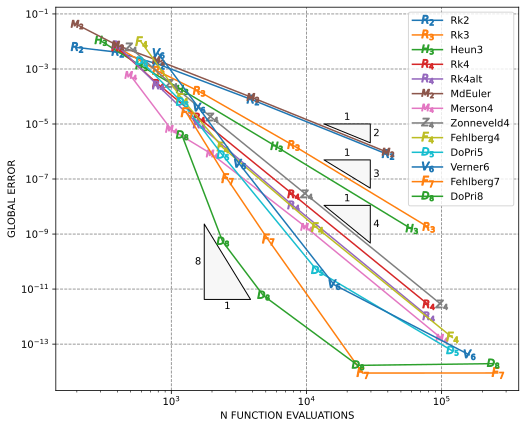

# Russell ODE - Solvers for Ordinary Differential Equations and Differential Algebraic Systems

_This crate is part of [Russell - Rust Scientific Library](https://github.com/cpmech/russell)_

## Contents

* [Introduction](#introduction)
* [Installation](#installation)
* [Setting Cargo.toml](#cargo)
* [Examples](#examples)

## <a name="introduction"></a> Introduction

This library implements (in pure Rust) solvers to ordinary differential equations (ODEs) and differential algebraic systems (DAEs). Specifically, this library implements several explicit Runge-Kutta methods (e.g., Dormand-Prince formulae) and two implicit Runge-Kutta methods, namely the Backward Euler and the Radau IIA of fifth-order (aka Radau5). The Radau5 solver is able to solver DAEs of Index-1, by accepting the so-called *mass matrix*.

## <a name="installation"></a> Installation

This crate depends on `russell_lab`, which, in turn, depends on an efficient BLAS library such as [OpenBLAS](https://github.com/OpenMathLib/OpenBLAS) and [Intel MKL](https://www.intel.com/content/www/us/en/docs/onemkl/developer-reference-c/2023-2/overview.html).

[The root README file presents the steps to install the required dependencies.](https://github.com/cpmech/russell)

## <a name="cargo"></a> Setting Cargo.toml

[](https://crates.io/crates/russell_ode)

👆 Check the crate version and update your Cargo.toml accordingly:

```toml
[dependencies]
russell_ode = "*"
```

## <a name="examples"></a> Examples

See also:

* [russell_ode/examples](https://github.com/cpmech/russell/tree/main/russell_ode/examples)

### Simple example

Solve the simple ODE:

```text
dy/dx = x + y    with    y(0) = 0
```

See the code [simple_ode.rs](https://github.com/cpmech/russell/tree/main/russell_ode/examples/simple_ode.rs); reproduced below:

```rust
use russell_lab::{vec_max_abs_diff, StrError, Vector};
use russell_ode::prelude::*;

fn main() -> Result<(), StrError> {
    // ODE system
    let ndim = 1;
    let system = System::new(
        ndim,
        |f, x, y, _args: &mut NoArgs| {
            f[0] = x + y[0];
            Ok(())
        },
        no_jacobian,
        HasJacobian::No,
        None,
        None,
    );

    // solver
    let params = Params::new(Method::DoPri8);
    let mut solver = OdeSolver::new(params, &system)?;

    // initial values
    let x = 0.0;
    let mut y = Vector::from(&[0.0]);

    // solve from x = 0 to x = 1
    let x1 = 1.0;
    let mut args = 0;
    solver.solve(&mut y, x, x1, None, None, &mut args)?;
    println!("y =\n{}", y);

    // check the results
    let y_ana = Vector::from(&[f64::exp(x1) - x1 - 1.0]);
    let (_, error) = vec_max_abs_diff(&y, &y_ana)?;
    println!("error = {:e}", error);
    assert!(error < 1e-8);

    // print stats
    println!("{}", solver.bench());
    Ok(())
}
```

The output looks like:

```text
y =
┌                    ┐
│ 0.7182818250641057 │
└                    ┘
error = 3.39E-09
DoPri8: Dormand-Prince method (explicit, order 8(5,3), embedded)
Number of function evaluations   = 108
Number of performed steps        = 9
Number of accepted steps         = 9
Number of rejected steps         = 0
Last accepted/suggested stepsize = 1.8976857444701694
Max time spent on a step         = 3.789µs
Total time                       = 48.038µs
```

### Brusselator ODE

#### Variable step sizes

This example solves the Brusselator ODE with variable step sizes for different tolerances. In this example, `tol = abs_tol = rel_tol`.

See the code [brusselator_ode_var_step.rs](https://github.com/cpmech/russell/tree/main/russell_ode/examples/brusselator_ode_var_step.rs)

The results are:

```text
━━━━━━━━━━━━━━━━━━━━━━━━━━━━━━━━━━━━━━━━━━━━━━━━━━━━
       tol =  1.00E-02  1.00E-04  1.00E-06  1.00E-08
      Method     Error     Error     Error     Error
────────────────────────────────────────────────────
      Radau5   1.9E-03   7.9E-06   1.3E-07   3.2E-09
     Merson4   3.8E-02   2.1E-04   9.9E-06   7.1E-08
      DoPri5   8.0E-03   1.7E-04   1.8E-06   2.0E-08
      DoPri8   1.4E-02   6.4E-06   2.7E-07   4.2E-09
━━━━━━━━━━━━━━━━━━━━━━━━━━━━━━━━━━━━━━━━━━━━━━━━━━━━
```

And the convergence plot is:


#### Fixed step sizes

This example solves the Brusselator ODE with fixed step sizes and explicit Runge-Kutta methods.

See the code [brusselator_ode_fix_step.rs](https://github.com/cpmech/russell/tree/main/russell_ode/examples/brusselator_ode_fix_step.rs)

The results are:

```text
━━━━━━━━━━━━━━━━━━━━━━━━━━━━━━━━━━━━━━━━━━━━━━━━━━━━━━━━
        h = 2.00E-01 1.00E-01 5.00E-02 1.00E-02 1.00E-03
     Method    Error    Error    Error    Error    Error
────────────────────────────────────────────────────────
        Rk2  6.1E-03  4.1E-03  1.5E-03  7.4E-05  7.8E-07
        Rk3  6.1E-03  8.2E-04  1.5E-04  1.7E-06  1.8E-09
      Heun3  1.1E-02  1.3E-03  1.7E-04  1.5E-06  1.5E-09
        Rk4  5.9E-03  2.8E-04  1.7E-05  2.7E-08  2.7E-12
     Rk4alt  7.0E-03  2.4E-04  9.3E-06  1.1E-08  9.9E-13
    MdEuler  4.1E-02  7.2E-03  2.0E-03  9.0E-05  9.2E-07
    Merson4  5.7E-04  6.3E-06  7.9E-07  1.7E-09  1.6E-13
 Zonneveld4  5.9E-03  2.8E-04  1.7E-05  2.7E-08  2.7E-12
  Fehlberg4  9.4E-03  8.1E-05  1.4E-06  1.7E-09  1.7E-13
     DoPri5  1.9E-03  6.1E-05  7.3E-07  4.7E-11  5.7E-14
    Verner6  3.6E-03  3.8E-05  3.5E-07  1.4E-11  4.1E-14
  Fehlberg7  2.5E-05  9.9E-08  6.3E-10  8.9E-15  8.9E-15
     DoPri8  3.9E-06  5.3E-10  5.8E-12  1.7E-14  2.0E-14
━━━━━━━━━━━━━━━━━━━━━━━━━━━━━━━━━━━━━━━━━━━━━━━━━━━━━━━━
```

And the convergence plot is:


